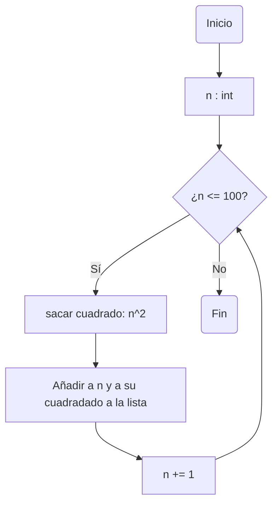
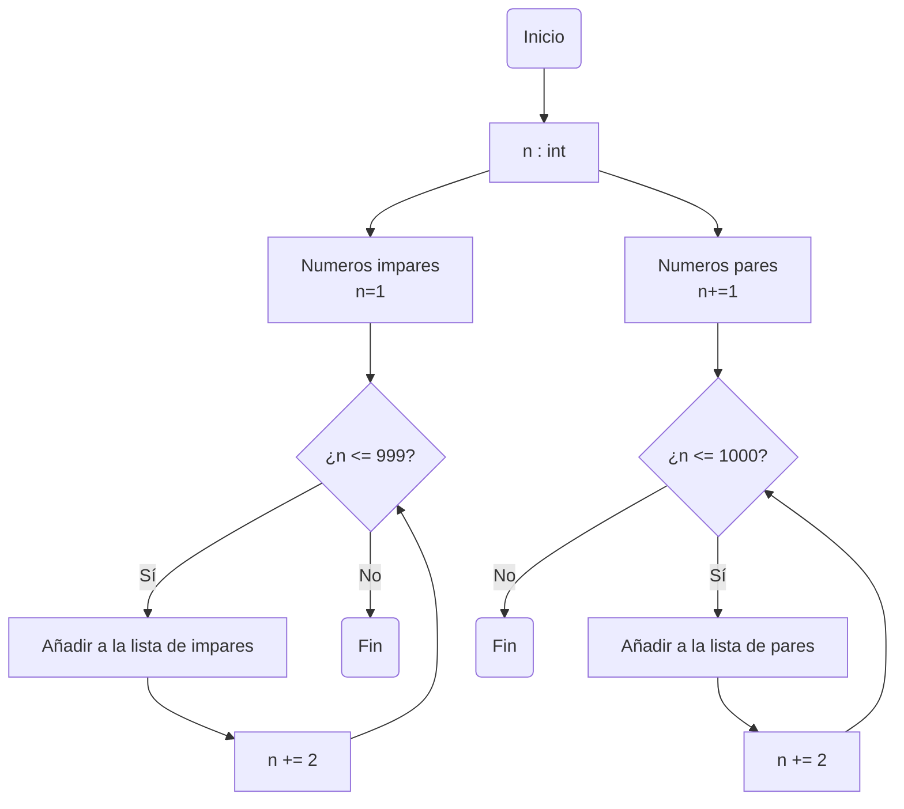
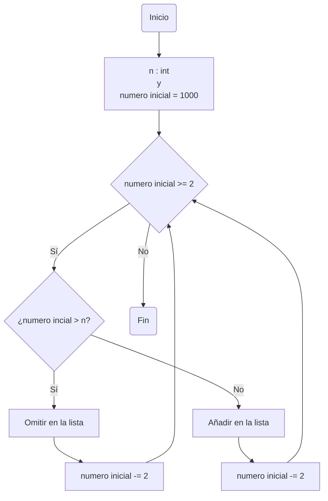

# Reto-7

Desarrollar de manera individual la mayoría de ejercicios en clase. Para cada punto crear un programa individual asimismo crear un notebook con la solución a todos los problemas. Al finalizar subir todo a un repo y subirlo al canal reto_7 en slack, los tres primeros puntos deben incluir diagrama de flujo.

1.Imprimir un listado con los números del 1 al 100 cada uno con su respectivo cuadrado.

```Python
numero_inicial = 1 #Primer numero del listado
cuadrado_num_inicial = numero_inicial **2 # Formula para sacarle el cuadrado a cada numero

#El "while" en este caso permitirá continuar con el bucle siempre que el numero inicial sea menor o igual a 100
#Ademas se encargará de sumar 1 al numero inicial y asi pasar por cada numero hasta llegar al 100

while numero_inicial <= 100:
    print(str(numero_inicial) + " su cuadrado es " + str(cuadrado_num_inicial))  
    numero_inicial += 1 
    cuadrado_num_inicial = numero_inicial **2 

print("fin")
```

Diagrama de flujo:



2. Imprimir un listado con los números impares desde 1 hasta 999 y seguidamente otro listado con los números pares desde 2 hasta 1000.

```python
primer_imp= 1 #Variable que hace referencia a los numeros impares, siendo esta en un principio el primer numero impar(1)

print ("Numeros impares:")

#Bucle encargado de sumarle 2 al primer numero impar siempre y cuando la variable "primer_imp" no sea mayor a 999

while primer_imp <= 999:
    print (primer_imp)
    primer_imp += 2

print ("Fin numeros impares")

print () #Espacio para tener cierto orden en al terminal

primer_par = 2 #Variable que hace referencia a los numeros pare, siendo esta en un principio el primer numero par(2)
print ("Numeros Pares:")

#Bucle encargado de sumarle 2 al primer numero par siempre y cuando la variable "primer_par" no sea mayor a 1000

while primer_par <= 1000:
    print (primer_par)
    primer_par += 2

print ("Fin numeros pares")
```

Diagrama de flujo:



3. Imprimir los números pares en forma descendente hasta 2 que son menores o iguales a un número natural n ≥ 2 dado

```python
numero_incial = 1000 #Numero donde se empezará a descender por los numeros pares hasta llegar a 2 
numero_n = int(input("Ingrese un numero naturar menor o igual a 2: ")) #Numero natural n que limitara limitara los numeros pares

print ("Los siguientes numeros pares son menores al numero natural dado")

#Bucle que le restara 2 al numero inicial y omitirá todo los numeros que sean mayores al numero natural dado por la terminal

while numero_incial > 2:
    numero_incial -= 2
    if numero_incial > numero_n:
        continue
    print(numero_incial)

print ("Fin del listado")
```

Diagrama de flujo:



4. En 2022 el país A tendrá una población de 25 millones de habitantes y el país B de 18.9 millones. Las tasas de crecimiento anual de la población serán de 2% y 3% respectivamente. Desarrollar un algoritmo para informar en que año la población del país B superará a la de A.

```python
pais_a = 25000000 #Cantidad país A
pais_b = 18900000 #Cantidad país B
año = 2023

#Bucle encargado de aumentar la tasa de crecimiento anual de la población tras cada año, con lo cual el bucle terminará hasta que
#el país B superé al país A

while pais_b < pais_a: 
    pais_b *= 1.03
    pais_a *= 1.02
    año += 1

print("En el año " + str(año) + " el pais B superara a el pais A ")
```

5. Imprimir el factorial de un número natural n dado.

```python
x = 1 #Esta variable va a permitir multiplicar cada uno de numeros anteriores al numero "n"
factorial= 1 #Esta variable se va a multiplicar con cada numero anterior al numero "n" y va a tomar ese valor
n = int(input("Ingrese un numero natural para factorizarlo: ")) #Es el numero al que se le va a sacar el factorial

#Bucle en el que "factorial" se multiplicara con cada numero anterior a "n" siempre y cuando "x" sea menor o igual a "n"

while x <= n:
    factorial *= x
    x += 1

print("El factorial de " + str(n) + " es " + str(factorial))    
```

6. Implementar un algoritmo que permita adivinar un número dado de 1 a 100, preguntando en cada caso si el número es mayor, menor o igual.
```python
print ("Elije un numero entre 1 y 100.")

#Se define el valor de igual como "False" por defecto para que cuando se tome que igual es verdadero este finalice el bucle

Igual = False 

#Bucle hecho a punta de condicionales, que van preguntando si un número es mayor, menor o igual a un número.
#El bucle se finaliza cuando la variable Igual sea equivalente a "True" que será cuando la terminal pregunte si el número es 
#igual al que se busca que la máquina "adivine"/"acierte"

while not Igual :
    print ('Para responder las siguientes preguntas, responda con un "SI" o con un "NO" según corresponda con su número elegido')
    primer_igual = input('Su número es igual a 50?: ')

    if primer_igual == "SI":
        Igual = True
        print ("Su numero es: 50 ")

    else:
        mayor_mitad = input('Su número es mayor a 50?: ')
        if mayor_mitad == "SI":
            segundo_igual = input('Su número es igual a 75?: ')
            if segundo_igual == "SI":
                Igual = True
                print("Su numero es: 75")

            else:
                if segundo_igual == "NO":
                    mitad_mayor_mitad = input ('Su número es mayor a 75?: ')
                    if mitad_mayor_mitad == "SI":
                        tercer_igual = input('Su número es igual a 85?: ')
                        if tercer_igual == "SI":
                            Igual = True
                            print("Su numero es: 85")
                        
                        else:

                            mitad_mayor_mitad_mayor = input ('Su número es mayor a 85?: ') 
                            if mitad_mayor_mitad_mayor == "SI":
                                adivinar_primero= 86
                                while Igual == False and adivinar_primero <= 100 :
                                    adiv = input("Su número es igual a " + str(adivinar_primero) + "?: ")
                                    adivinar_primero += 1
                                    if adiv == "SI":
                                        adivinar_primero -=1 #Soltaba el numero que va despues, entonces se usa para corregir ese error (muy probablemente mio y no lo noto)
                                        print("Su número es: " + str(adivinar_primero))
                                        Igual = True

                            elif mitad_mayor_mitad_mayor == "NO":
                                    adivinar_segundo = 84
                                    while Igual == False and adivinar_segundo >= 76 :
                                        adiv_segundo = input("Su número es igual a " + str(adivinar_segundo)+ "?: ")
                                        adivinar_segundo -= 1
                                        if adiv_segundo == "SI":
                                            adivinar_segundo += 1 #Mismo caso al anterior (pone el numero anterior) y se repite en las siguientes 
                                            print("Su número es: " + str(adivinar_segundo))
                                            Igual = True
                    else:
                        if mitad_mayor_mitad == "NO":
                            adivinar_tercero = 74
                            while Igual == False and adivinar_tercero >= 51 :
                                adiv_tercero = input("Su número es igual a " + str(adivinar_tercero) + "?: ")
                                adivinar_tercero -= 1
                                if adiv_tercero == "SI":
                                    adivinar_tercero +=1
                                    print("Su número es: " + str(adivinar_tercero))
                                    Igual = True
        
        else:
            if mayor_mitad == "NO":
                cuarto_igual = input ("Su número es igual a 25?: ")
                if cuarto_igual == "SI":
                    Igual = True
                    print("Su número es 25")
                
                else:
                    if cuarto_igual == "NO":
                        mitad_menor_mitad = input ("Su número es mayor a 25?: ")
                        if mitad_menor_mitad == "SI":
                            quinto_igual = input ("Su número es igual a 37?: ")
                            if quinto_igual == "SI":
                                Igual = True
                                print("Su número es 37")

                            else:

                                if quinto_igual == "NO":
                                    mitad_menor_mitad_mayor = input ("Su número es mayor a 37?: ")
                                    if mitad_menor_mitad_mayor == "SI":
                                        adivinar_cuarto = 38
                                        while Igual == False and adivinar_cuarto <= 49:
                                            adiv_cuarto= input("Su número es igual a " + str(adivinar_cuarto) + " ?: " )
                                            adivinar_cuarto += 1
                                            if adiv_cuarto == "SI":
                                                adivinar_cuarto -=1
                                                print("Su número es: " + str(adivinar_cuarto))
                                                Igual = True
                                    
                                    else:

                                        if mitad_menor_mitad_mayor == "NO":
                                            adivinar_quinto = 36
                                            while Igual == False and adivinar_quinto >= 26:
                                                adiv_quinto = input("Su número es igual a " + str(adivinar_quinto)+ " ?: ")
                                                adivinar_quinto -= 1
                                                if adiv_quinto == "SI":
                                                    adivinar_quinto += 1
                                                    print("Su número es: " + str(adivinar_quinto))
                                                    Igual = True
                    
                        else: 

                            if mitad_menor_mitad == "NO":
                                mitad_menor_mitad_menor = input("Su número es menor a 25?: ")
                                if mitad_menor_mitad_menor == "SI":
                                    sexto_igual = input("Su número es igual a 12?: ")
                                    if sexto_igual == "SI":
                                        Igual = True
                                        print("Su número es 12")

                                    else:

                                        if sexto_igual == "NO":
                                            mitad_menor_de_la_mitad = input("Su numero es mayor a 12?: ")
                                            if mitad_menor_de_la_mitad == "SI":
                                                adivinar_sexto = 13
                                                while Igual == False and adivinar_sexto <= 24:
                                                    adiv_sexto = input("Su número es igual a " + str(adivinar_sexto)+ " ?: ")
                                                    adivinar_sexto += 1
                                                    if adiv_sexto == "SI":
                                                        adivinar_sexto -= 1
                                                        print("Su número es: " + str(adivinar_sexto))
                                                        Igual = True
                                        
                                            else:
                                                if mitad_menor_de_la_mitad == "NO":
                                                    adivinar_sept = 12
                                                    while Igual == False and adivinar_sept >= 1:
                                                        adiv_sept = input("Su número es igual a " + str(adivinar_sept)+ " ?: ")
                                                        adivinar_sept -= 1 
                                                        if adiv_sept == "SI":
                                                            adivinar_sept += 1
                                                            print("Su número es: "+ str(adivinar_sept))
                                                            Igual = True
```

7. Implementar un programa que ingrese un número de 2 a 50 y muestre sus divisores.

```python
numero = int(input("Ingrese un numero de 2 a 50: "))
divisor = 50 #Variable desde donde se iniciará a revisar 

#Bucle en el que se dividirá el número dado en la terminal con los números del 2 al 50 (debido a que la variable "divisor" se 
#irá restando 1 tras cada división) y se obtendrá el residuo que genera la división, en el que se imprimirán solo los números
#en el que su residuo sea igual a 0

while divisor > 1  :
    if numero % divisor == 0 :
        print (divisor)

    divisor -= 1
```

8. Implementar el algoritmo que muestre los números primos del 1 al 100. Nota: use funciones

```python
#Esta funcion se encarga de definir si los numeros entregados son numeros primos, devuelve un "True" si el numero es primo y un "False"
#si es lo contrario

def primo(numero):

    if numero <= 1:
        return False
    divisor = 2

#El bucle de la función se va a encargar de ver si los numeros son divisibles por la variable "divisor" (siendo que esta va a tomar 
#varios valores mientras que la potencia del "divisor" sea menor o igual al número que se busca saber si es primo), con el fin de 
#saber si el número es divisible, lo que quiere decir que el número no es primo devolviendo el resultado como "False", de lo 
#contrario si no es divisible por ningún número significa que es primo y devolvera el resultado como "True"

    while (divisor **2) <= numero:
        if numero % divisor == 0:
            return False
        divisor += 1
    return True

#Esta función se encargará de mostrar todos los numeros hasta un numero cualquiera dado, en este caso se limitará hasta 100 

def limite_primos(n):

    print("Números primos del 1 al " + str(n))
    
#El siguiente bucle se encargará de verificar si, a partir de la variable "num" si el número es primo usando la primera función,
#si identifica que el número es primo lo imprimirá. Además incrementará en 1 el número hasta llegar a 100.
    
    num = 2
    while num <= n:
        if primo(num):
            print(num)
        num += 1


limite_primos(100) #Limita los primos mostrados hasta 100
```
